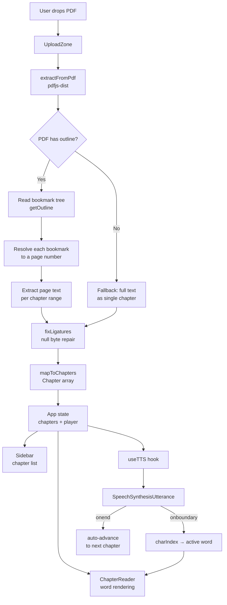

# ReadAloud

A browser-based PDF-to-audio reader that converts any PDF into a narrated, chapter-by-chapter listening experience — no backend, no API keys, no cost.

**Live demo:** [readaloud.vercel.app](https://readaloud.vercel.app)

---

## Features

- **PDF outline extraction** — reads the PDF's built-in bookmark tree (the same source Adobe uses) to produce a perfectly accurate chapter list
- **Text-to-speech playback** — browser-native `SpeechSynthesis` API with voice selection and variable speed (0.75x – 2x)
- **Word-by-word highlighting** — tracks the active word in real time using `SpeechSynthesisUtterance.onboundary` events, with auto-scroll
- **Reading progress** — sticky progress bar and percentage counter per chapter
- **Ligature repair** — fixes common PDF encoding issues (`\uFB01` fi/fl ligatures and font-specific null byte substitutions) so TTS reads cleanly
- **Open new file** — swap PDFs without reloading the page
- **Zero dependencies on paid services** — runs entirely in the browser

---

## Tech Stack

| Layer          | Choice                             |
| -------------- | ---------------------------------- |
| Frontend       | React 18, TypeScript, Vite         |
| Styling        | Tailwind CSS v4                    |
| Icons          | lucide-react                       |
| PDF parsing    | pdfjs-dist (Mozilla)               |
| Text-to-speech | Web Speech API (`SpeechSynthesis`) |

---

## Architecture



---

## Engineering Decisions

**Why pdfjs-dist over a server-side parser?**
Running PDF parsing entirely in the browser means zero infrastructure, zero cost, and no file uploads to a server. For a reading app where PDFs may contain personal or sensitive content, keeping everything client-side is the right privacy tradeoff.

**Why the PDF outline tree instead of text parsing?**
Early versions used regex to detect lines containing "chapter" — this produced false positives from tables of contents and missed chapters with non-standard headings. Switching to `pdf.getOutline()` reads the same bookmark metadata Adobe uses, giving perfect accuracy for any well-formed PDF.

**Why Web Speech API instead of a cloud TTS service?**
The Web Speech API is free, requires no API key, and works offline. The tradeoff is voice quality varies by browser and OS. A natural next step (v2) would be Google Cloud TTS or ElevenLabs, which return audio bytes directly and would also unlock true MP3 export via JSZip.

**Ligature repair**
Many PDFs encode fi/fl ligatures as either Unicode private-use codepoints (`\uFB01`, `\uFB02`) or as null bytes (`\u0000`) depending on the font embedding. Without repair, TTS skips or mispronounces words like "fish" → "sh" and "fleet" → "eet". The fix maps each null byte pattern to its correct ligature using the characters that follow as context.

**Audio export limitation**
`SpeechSynthesis` renders audio directly to the OS audio device — there is no Web Audio API intercept point. True export would require a server-side TTS API that returns audio blobs. This is documented as a known limitation and scoped to v2.

---

## Local Development

```bash
git clone https://github.com/terrence-celestine/readaloud.git
cd readaloud
npm install
npm run dev
```

Open [http://localhost:5173](http://localhost:5173) and drop in any PDF with a bookmark outline.

---

## Known Limitations

- **Voice quality** depends on the voices installed in the user's browser/OS. Google voices in Chrome are noticeably more natural than system defaults.
- **Audio export** is not currently supported. `SpeechSynthesis` audio cannot be intercepted by the browser — a v2 with a cloud TTS backend would enable this.
- **PDFs without outlines** fall back to a single "Full Document" chapter with all text concatenated.
- **Null byte ligatures** are repaired heuristically based on surrounding characters. Unusual fonts may produce edge cases.

---

## Roadmap

- [ ] Cloud TTS backend (Google Cloud TTS / ElevenLabs) for higher quality voices and MP3 export
- [ ] JSZip export — bundle chapters as audio files
- [ ] Bookmark position — resume where you left off
- [ ] Mobile layout
- [ ] Support for `.txt` and `.md` input formats
